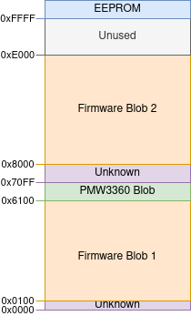

# rival310-re

Reverse engineering of the [Rival310](https://steelseries.com/gaming-mice/rival-310) and Sensei310 gaming mouse by [Steelseries](https://steelseries.com/)

Specs:
 - CPI 100–12000 in 100 Increments
 - IPS 350+
 - Acceleration 50G
 - Polling Rate 1 ms

### hardware

The main board consists of:

 - The TRUEMOVE3 sensor
 - A STM32F103T6 in QFN48 package
 - A 12 MHz Crystal for the MCU
 - A 512kbit(64kB) external EEPROM in TSSOP8 package
 - Two independent 3030 RGB Leds (one is in an extension board, lights up the scroll wheel)
 - 5 OMRON buttons (specs TBD)
 - ALPS AB Encoder (specs TBD)

The buttons and encoder seem to have hardware decoupling, although the components are not populated.

In the documentation subfolder you can find datasheets and pictures of the board.

#### testpoints

The PCB contains a bunch of testpoints that can be helpful.

testpoint | Funcion
:---: | :---:
TP1 | TRUEMOVE3 VDD (2V) ?
TP2 | TRUEMOVE3 Reset ?
TP3 | Logo Red
TP4 | Logo Green
TP5 | Logo Blue
TP6 | Scroll wheel Red
TP7 | Scroll wheel green
TP8 | Scroll wheel Blue
TP9 | Left btn
TP10 | Right btn
TP11 | Middle btn
TP12 | ENC A/B
TP13 | MCU Reset
TP14 | ENC A/B
TP15 | USB DP Through R21 ?
TP16 | USB DP
TP17 | USB DM
TP18 | SPI MISO
TP19 | SPI MOSI
TP20 | SPI SCK
TP21 | TRUEMOVE3 motion
TP22 | SPI CS
TP23 | GND
TP25 | 5V
TP26 | 3V3
TP27 | 2V
TP28 | PB3 (DPI Btn / SWO)
TP29 | Forward/Back btn
TP30 | Forward/Back btn
TP35 | LED ?
TP36 | LED ?
TP37 | LED ?

#### MCU connections

Pin number | Pin name | Function
:---: | :---: | :---:
2 | PD0 | 
3 | PD1 | 
7 | PA0 | Scroll wheel LED Green
8 | PA1 | Scroll wheel LED Red
9 | PA2 | Scroll wheel LED Blue
10 | PA3 | TRUEMOVE3 motion
11 | PA4 | SPI chip select
12 | PA5 | SPI clock
13 | PA6 | SPI MISO
14 | PA7 | SPI MOSI
15 | PB0 | Left button
16 | PB1 | Middle button
17 | PB2 | Right button
20 | PA8 | Logo LED Green 
21 | PA9 | Logo LED Red
22 | PA10 | Logo LED Blue
23 | PA11 | USB DM
24 | PA12 | USB DP
25 | PA13 | SDIO
28 | PA14 | SWCLK
29 | PA15 | 
30 | PB3 | DPI button
31 | PB4 | Encoder A/B
32 | PB5 | Encoder A/B
33 | PB6 | Back button
34 | PB7 | Forward button
35 | BOOT0 | Grounded

You can have a further look by taking a peek at the [schematic](board/schematic.pdf) in the board folder.

### firmware

There is no effort being put to reverse engineering the embedded firmware, as our plan is to rewrite one from scratch.

We know now that the MCU as a Bootloader programmed in it's flash memory, that retrieves the firmware from the external EEPROM.

#### Programing the mainboard

The main board has the programing pins exposed and labeled in a 2x2 header connector.

programing can be done with any programmer capable of SWD for cortex-m microcontrollers.

examples are:
 - ST-Link
 - J-Link
 - FT2232H + openocd

### Sensor

The Rival310 comes with a TRUEMOVE3 sensor, this sensor originates from a colaboration between Steelseries and [Pixart](https://www.pixart.com/index/).

it is heavily based on the popular PMW3360.

A reverse engineering effort towards this sensor is being made in a separate repo [truemove3-re](https://github.com/gimbas/truemove3-re).

### External EEPROM

512kibit(64kiB) EEPROM, manufactured by [ST](https://www.st.com/), reference M95512.
It has an address span from 0x0000 t0 0xFFFF.

There's a datasheet in the documentation folder.

The external EEPROM is most likely used to store configurations, and firmware blobs, we have not identified what is stored and where except for the TRUEMOVE3 firmware, and the main MCU firmware.

The TRUEMOVE3 firmware is stored in the external EEPROM, it consists of the 4094 continuous bytes starting in address 0x6100.

The main MCU firmware is stored starting in address 0x8108.

You can take a look at the contents of the EEPROM in [eeprom_dump](eeprom_dump).

### Protocol

The protocol has been reverse engineered in a seperate [repo](https://github.com/FFY00/rival310-re) by [FFY00](https://github.com/FFY00)
